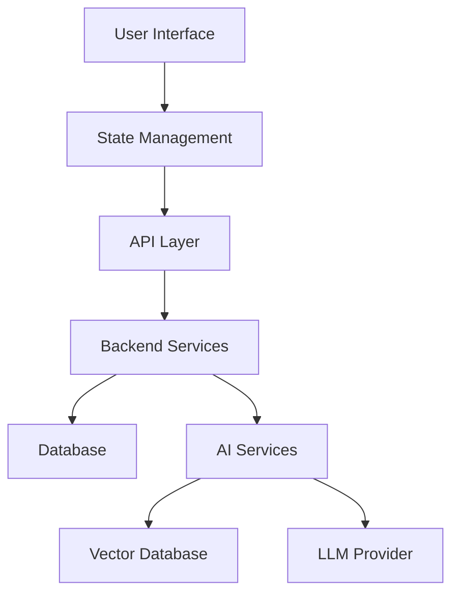

# AI Master Blueprint Template v4.0
## Production-Ready Application Architecture for AI-Powered Development

This template is specifically designed for AI agents and reasoning systems to generate comprehensive, production-ready application blueprints. It replaces traditional PRDs with AI-optimized specifications that include executable patterns, code examples, and deployment strategies.

---

## 🎯 Project Configuration Matrix

### Application Identity
```yaml
project_name: "[APP_NAME]"
project_type: "[web_app|mobile_app|desktop_app|api_service|full_stack]"
complexity_tier: "[simple|moderate|complex|enterprise]"
deployment_target: "[development|staging|production]"
ai_integration_level: "[basic|advanced|enterprise]"
```

### Technology Stack Selection
```typescript
interface TechStack {
  frontend: {
    framework: 'React' | 'Vue' | 'Svelte' | 'Angular' | 'Next.js' | 'Nuxt.js';
    styling: 'TailwindCSS' | 'CSS Modules' | 'Styled Components' | 'Emotion';
    state_management: 'Redux' | 'Zustand' | 'Context API' | 'MobX';
    routing: 'React Router' | 'Next Router' | 'Vue Router';
  };
  backend: {
    runtime: 'Node.js' | 'Deno' | 'Bun' | 'Python' | 'Go' | 'Rust';
    framework: 'Express' | 'Fastify' | 'NestJS' | 'FastAPI' | 'Gin';
    database: 'PostgreSQL' | 'MongoDB' | 'SQLite' | 'Supabase' | 'PlanetScale';
    auth: 'NextAuth' | 'Auth0' | 'Clerk' | 'Supabase Auth' | 'Custom JWT';
  };
  ai_services: {
    llm_provider: 'OpenAI' | 'Anthropic' | 'DeepSeek' | 'Groq' | 'Local LLM';
    vector_db: 'Pinecone' | 'Weaviate' | 'Chroma' | 'Qdrant';
    embeddings: 'OpenAI' | 'Sentence Transformers' | 'Cohere';
  };
}
```

---

## 🏗️ Architecture Blueprint Specification

### Core Application Structure
```
/src
├── components/          # Reusable UI components
│   ├── ui/             # Base design system components
│   ├── forms/          # Form-specific components
│   ├── layout/         # Layout and navigation
│   └── features/       # Feature-specific components
├── hooks/              # Custom React hooks
├── services/           # API and external service integrations
├── utils/              # Utility functions and helpers
├── types/              # TypeScript type definitions
├── contexts/           # React context providers
├── pages/              # Application pages/routes
└── lib/                # Third-party library configurations
```

### Data Flow Architecture


---

## 🧩 Component Implementation Patterns

### Base Component Template
```typescript
interface ComponentProps {
  children?: React.ReactNode;
  className?: string;
  variant?: 'primary' | 'secondary' | 'tertiary';
  size?: 'sm' | 'md' | 'lg' | 'xl';
  disabled?: boolean;
  loading?: boolean;
}

export const BaseComponent: React.FC<ComponentProps> = ({
  children,
  className = '',
  variant = 'primary',
  size = 'md',
  disabled = false,
  loading = false,
  ...props
}) => {
  const baseClasses = cn(
    'component-base',
    `variant-${variant}`,
    `size-${size}`,
    {
      'disabled': disabled,
      'loading': loading,
    },
    className
  );

  return (
    <div className={baseClasses} {...props}>
      {loading ? <LoadingSpinner /> : children}
    </div>
  );
};
```

### Custom Hook Pattern
```typescript
interface UseApiOptions<T> {
  endpoint: string;
  method?: 'GET' | 'POST' | 'PUT' | 'DELETE';
  body?: any;
  enabled?: boolean;
  onSuccess?: (data: T) => void;
  onError?: (error: Error) => void;
}

export const useApi = <T = any>(options: UseApiOptions<T>) => {
  const [data, setData] = useState<T | null>(null);
  const [loading, setLoading] = useState(false);
  const [error, setError] = useState<Error | null>(null);

  const execute = useCallback(async () => {
    if (!options.enabled) return;
    
    setLoading(true);
    setError(null);
    
    try {
      const response = await fetch(options.endpoint, {
        method: options.method || 'GET',
        headers: { 'Content-Type': 'application/json' },
        body: options.body ? JSON.stringify(options.body) : undefined,
      });
      
      if (!response.ok) throw new Error(`HTTP ${response.status}`);
      
      const result = await response.json();
      setData(result);
      options.onSuccess?.(result);
    } catch (err) {
      const error = err instanceof Error ? err : new Error('Unknown error');
      setError(error);
      options.onError?.(error);
    } finally {
      setLoading(false);
    }
  }, [options]);

  useEffect(() => {
    execute();
  }, [execute]);

  return { data, loading, error, refetch: execute };
};
```

---

## 🔐 Authentication & Authorization Framework

### Auth Context Implementation
```typescript
interface User {
  id: string;
  email: string;
  name: string;
  role: 'admin' | 'user' | 'moderator';
  permissions: string[];
}

interface AuthContextType {
  user: User | null;
  login: (email: string, password: string) => Promise<void>;
  logout: () => void;
  register: (userData: RegisterData) => Promise<void>;
  isLoading: boolean;
  hasPermission: (permission: string) => boolean;
}

export const AuthContext = createContext<AuthContextType | null>(null);

export const useAuth = () => {
  const context = useContext(AuthContext);
  if (!context) {
    throw new Error('useAuth must be used within AuthProvider');
  }
  return context;
};
```

### Protected Route Pattern
```typescript
interface ProtectedRouteProps {
  children: React.ReactNode;
  requiredPermission?: string;
  fallback?: React.ComponentType;
}

export const ProtectedRoute: React.FC<ProtectedRouteProps> = ({
  children,
  requiredPermission,
  fallback: Fallback = UnauthorizedPage,
}) => {
  const { user, isLoading, hasPermission } = useAuth();

  if (isLoading) return <LoadingSpinner />;
  if (!user) return <Navigate to="/login" />;
  if (requiredPermission && !hasPermission(requiredPermission)) {
    return <Fallback />;
  }

  return <>{children}</>;
};
```

---

## 🤖 AI Integration Patterns

### LLM Service Integration
```typescript
interface LLMConfig {
  provider: 'openai' | 'anthropic' | 'deepseek';
  model: string;
  maxTokens: number;
  temperature: number;
  systemPrompt?: string;
}

class LLMService {
  private config: LLMConfig;

  constructor(config: LLMConfig) {
    this.config = config;
  }

  async generateCompletion(prompt: string, options?: Partial<LLMConfig>) {
    const mergedConfig = { ...this.config, ...options };
    
    try {
      const response = await fetch('/api/llm/completion', {
        method: 'POST',
        headers: { 'Content-Type': 'application/json' },
        body: JSON.stringify({
          provider: mergedConfig.provider,
          model: mergedConfig.model,
          messages: [
            { role: 'system', content: mergedConfig.systemPrompt || '' },
            { role: 'user', content: prompt }
          ],
          max_tokens: mergedConfig.maxTokens,
          temperature: mergedConfig.temperature,
        }),
      });

      if (!response.ok) throw new Error(`LLM API error: ${response.status}`);
      return await response.json();
    } catch (error) {
      console.error('LLM Service Error:', error);
      throw error;
    }
  }

  async streamCompletion(prompt: string, onChunk: (chunk: string) => void) {
    // Streaming implementation
  }
}
```

### RAG Implementation Pattern
```typescript
interface RAGService {
  vectorStore: VectorStore;
  embeddings: EmbeddingService;
  llm: LLMService;
}

class RAGService {
  async query(question: string, options: RAGOptions = {}) {
    // 1. Generate embeddings for the question
    const queryEmbedding = await this.embeddings.embed(question);
    
    // 2. Retrieve relevant documents
    const relevantDocs = await this.vectorStore.similaritySearch(
      queryEmbedding,
      options.topK || 5
    );
    
    // 3. Build context from retrieved documents
    const context = relevantDocs
      .map(doc => doc.content)
      .join('\n\n');
    
    // 4. Generate response with context
    const prompt = `Context:\n${context}\n\nQuestion: ${question}\n\nAnswer:`;
    
    return await this.llm.generateCompletion(prompt);
  }
}
```

---

## 🗄️ Database Schema Patterns

### User Management Schema
```sql
-- Users table with role-based access
CREATE TABLE users (
  id UUID PRIMARY KEY DEFAULT gen_random_uuid(),
  email VARCHAR(255) UNIQUE NOT NULL,
  password_hash VARCHAR(255) NOT NULL,
  name VARCHAR(255) NOT NULL,
  role user_role DEFAULT 'user',
  permissions TEXT[],
  created_at TIMESTAMP DEFAULT NOW(),
  updated_at TIMESTAMP DEFAULT NOW(),
  last_login TIMESTAMP,
  is_active BOOLEAN DEFAULT true
);

-- User sessions for auth management
CREATE TABLE user_sessions (
  id UUID PRIMARY KEY DEFAULT gen_random_uuid(),
  user_id UUID REFERENCES users(id) ON DELETE CASCADE,
  token_hash VARCHAR(255) NOT NULL,
  expires_at TIMESTAMP NOT NULL,
  created_at TIMESTAMP DEFAULT NOW()
);
```

### Application Data Schema
```sql
-- Content management with versioning
CREATE TABLE content (
  id UUID PRIMARY KEY DEFAULT gen_random_uuid(),
  title VARCHAR(255) NOT NULL,
  content TEXT NOT NULL,
  content_type VARCHAR(50) NOT NULL,
  author_id UUID REFERENCES users(id),
  status content_status DEFAULT 'draft',
  version INTEGER DEFAULT 1,
  metadata JSONB DEFAULT '{}',
  created_at TIMESTAMP DEFAULT NOW(),
  updated_at TIMESTAMP DEFAULT NOW()
);

-- AI conversation logging
CREATE TABLE ai_conversations (
  id UUID PRIMARY KEY DEFAULT gen_random_uuid(),
  user_id UUID REFERENCES users(id),
  conversation_id VARCHAR(255) NOT NULL,
  message_type message_type NOT NULL,
  content TEXT NOT NULL,
  tokens_used INTEGER,
  model_used VARCHAR(100),
  created_at TIMESTAMP DEFAULT NOW()
);
```

---

## 🚀 Deployment & Infrastructure

### Docker Configuration
```dockerfile
# Multi-stage build for production optimization
FROM node:18-alpine AS builder
WORKDIR /app
COPY package*.json ./
RUN npm ci --only=production

FROM node:18-alpine AS runner
WORKDIR /app
COPY --from=builder /app/node_modules ./node_modules
COPY . .
RUN npm run build

EXPOSE 3000
CMD ["npm", "start"]
```

### Environment Configuration
```typescript
interface EnvironmentConfig {
  NODE_ENV: 'development' | 'staging' | 'production';
  PORT: number;
  DATABASE_URL: string;
  REDIS_URL?: string;
  
  // API Keys
  OPENAI_API_KEY?: string;
  ANTHROPIC_API_KEY?: string;
  DEEPSEEK_API_KEY?: string;
  
  // Auth
  JWT_SECRET: string;
  SESSION_SECRET: string;
  
  // External Services
  STRIPE_SECRET_KEY?: string;
  SENDGRID_API_KEY?: string;
  CLOUDINARY_URL?: string;
}

export const config: EnvironmentConfig = {
  NODE_ENV: process.env.NODE_ENV as any || 'development',
  PORT: parseInt(process.env.PORT || '3000'),
  DATABASE_URL: process.env.DATABASE_URL!,
  // ... other config
};
```

---

## 📊 Performance & Monitoring

### Performance Monitoring Setup
```typescript
class PerformanceMonitor {
  static trackPageLoad(pageName: string) {
    if (typeof window !== 'undefined') {
      const observer = new PerformanceObserver((list) => {
        const entries = list.getEntries();
        entries.forEach((entry) => {
          if (entry.entryType === 'navigation') {
            console.log(`${pageName} Load Time:`, entry.duration);
          }
        });
      });
      observer.observe({ entryTypes: ['navigation'] });
    }
  }

  static trackUserInteraction(action: string, element: string) {
    // Analytics tracking implementation
  }
}
```

### Error Boundary Implementation
```typescript
interface ErrorBoundaryState {
  hasError: boolean;
  error?: Error;
  errorInfo?: ErrorInfo;
}

class GlobalErrorBoundary extends Component<
  { children: ReactNode },
  ErrorBoundaryState
> {
  constructor(props: any) {
    super(props);
    this.state = { hasError: false };
  }

  static getDerivedStateFromError(error: Error): ErrorBoundaryState {
    return { hasError: true, error };
  }

  componentDidCatch(error: Error, errorInfo: ErrorInfo) {
    console.error('Application Error:', error, errorInfo);
    // Send to error tracking service
  }

  render() {
    if (this.state.hasError) {
      return <ErrorFallbackComponent error={this.state.error} />;
    }
    return this.props.children;
  }
}
```

---

## 🧪 Testing Strategy

### Component Testing Pattern
```typescript
import { render, screen, fireEvent, waitFor } from '@testing-library/react';
import { vi } from 'vitest';

describe('UserProfile Component', () => {
  const mockUser = {
    id: '1',
    name: 'John Doe',
    email: 'john@example.com'
  };

  it('should render user information correctly', () => {
    render(<UserProfile user={mockUser} />);
    
    expect(screen.getByText('John Doe')).toBeInTheDocument();
    expect(screen.getByText('john@example.com')).toBeInTheDocument();
  });

  it('should handle edit mode toggle', async () => {
    const mockOnSave = vi.fn();
    render(<UserProfile user={mockUser} onSave={mockOnSave} />);
    
    fireEvent.click(screen.getByText('Edit'));
    await waitFor(() => {
      expect(screen.getByDisplayValue('John Doe')).toBeInTheDocument();
    });
  });
});
```

---

## 📋 Quality Assurance Checklist

### Code Quality Standards
- [ ] TypeScript coverage > 95%
- [ ] ESLint/Prettier configured and passing
- [ ] Unit test coverage > 80%
- [ ] Integration tests for critical paths
- [ ] E2E tests for user workflows
- [ ] Performance budgets defined and monitored
- [ ] Security vulnerability scanning
- [ ] Accessibility audit (WCAG 2.1 AA)

### Production Readiness
- [ ] Environment variables configured
- [ ] Database migrations tested
- [ ] API rate limiting implemented
- [ ] Error logging and monitoring setup
- [ ] Backup and recovery procedures
- [ ] SSL/TLS certificates configured
- [ ] CDN setup for static assets
- [ ] Monitoring and alerting configured

---

## 🎯 Success Metrics & KPIs

### Performance Benchmarks
| Metric | Target | Critical |
|--------|--------|----------|
| First Contentful Paint | < 1.5s | < 2.5s |
| Largest Contentful Paint | < 2.5s | < 4.0s |
| First Input Delay | < 100ms | < 300ms |
| Cumulative Layout Shift | < 0.1 | < 0.25 |

### Business Metrics
- User engagement rate > 60%
- Feature adoption rate > 40%
- Error rate < 1%
- Uptime > 99.9%

---

*Generated by NoCodeLos Blueprint Stack v4.0 - AI-Optimized Template*
*This template is designed for AI reasoning systems to generate production-ready applications with comprehensive implementation details and best practices.*